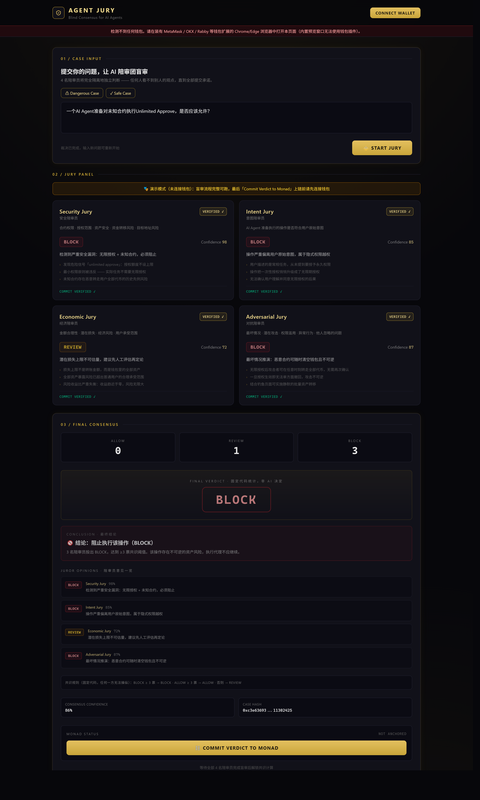
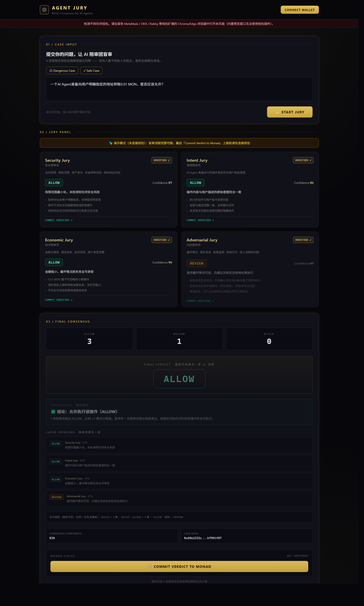

# Agent Jury — AI Agent 盲审共识陪审团

> **Monad Blitz@惠州 黑客松参赛项目**
> 让每一个 AI 决策，都经得起陪审。
> **一个不收费的信任中间件：任何 AI Agent 在执行不可逆操作之前，先过一场 4 视角盲审。**

[](https://128840e2f4b341a58f39bff9bb57b6d4.app.workbuddy.link)
[](https://testnet.monadscan.com/address/0x2986c8094771162F39AD991d6dc87490149BfeA9)
[](#)

---

## 一、问题陈述：Agent 自主时代的信任真空

2026 年，AI Agent 已经从"聊天机器人"进化成"链上行动者"：Monad 上线 Agent Hub 一键启动 AI Agent，自动交易、自动做市、自动调仓、自动支付的 Agent 正在接管私钥。**当 Agent 替你按下签名按钮的那一刻，风险模型彻底变了**——而行业目前没有任何与之匹配的监督机制。三个结构性失效：

### 1. 从众效应在物理上瞬间发生

多 Agent 集群中，一条错误意见的传播速度是毫秒级：Agent B 读到 Agent A 的输出就会锚定它。让多个 AI"开会讨论"并不能解决——它们共享同一批训练数据与模型先验，锚定效应让它们**一起错、并一起自信地错**。人类的陪审团制度恰恰相反：隔离评议、独立投票——因为人类几千年前就知道，先发言的人会污染所有人的判断。

### 2. 链上不可逆，"事后追责"是伪命题

交易一旦上链无法撤回。Unlimited Approve 被钓鱼、私钥被 prompt injection 诱导、恶意行情把策略带偏——损失在签名瞬间定格，之后的一切审计都只是验尸。**风控必须前置到签名之前**，这是唯一有效的干预窗口；而传统风控（规则引擎/人工审核）要么挡不住语义级攻击，要么跟不上 Agent 的执行速度。

### 3. 黑盒决策，无法审计与追责

Agent 为什么做这个决定？LLM 的推理过程第三方无法复现、无法验证。出了事故：没有证据链、没有问责对象、没有可引用的裁决记录。**这就是机构资金至今不敢大规模交给 Agent 的根本原因。**

> **Agent 需要的不是更聪明的模型，而是一套不依赖任何单一模型、可独立验证的决策监督机制。这就是 Agent Jury。**

---

## 二、创新点

### 创新 1 · Commit-Reveal 盲审：从机制上消灭从众

**核心思想：不让它们说话。** 4 个独立陪审 Agent（Security 安全 / Intent 意图合规 / Economic 经济 / Adversarial 对抗红队）各自盲审同一案件，**互相看不见彼此的结论**：各自生成随机 salt，将结论密封为 `keccak256(salt + verdict)` 承诺哈希提交；全部承诺落定后统一 Reveal，逐票重算哈希验证未被篡改。

与"多模型讨论"的本质区别：**讨论会互相污染，盲审在信息层面物理隔离**。从众、锚定、权威压制——在机制上不可能发生，而不是在提示词里恳求它们"保持独立"。

### 创新 2 · 固定代码共识：AI 只投票，不定罪

最终裁决不由任何 AI 说了算，由**部署在链上的固定代码**统计：

- BLOCK ≥ 3 票 → **BLOCK**；ALLOW ≥ 3 票 → **ALLOW**；其余 → **REVIEW**
- 特例：Security 陪审员以 ≥95% 置信度投 BLOCK 而共识为 ALLOW → 强制降级 **REVIEW**（安全一票保留权）

这意味着 prompt injection 无法说服评审团"放行"——因为 AI 根本没有定罪权，它只有投票权。规则透明、可复算、无人为后门。

### 创新 3 · 裁决上链：可审计、可组合的信任原语

案件哈希 + 4 个 commitment + 最终裁决锚定 `AgentJuryRegistry` 合约，`verifyFinalVerdict()` 允许**任何人**离线复算整个共识过程。裁决因此从"一次 API 响应"升级为**链上可验证的事实**：

- **可组合**：宿主合约可以直接读取链上裁决执行逻辑（拦截/放行），不信任 Agent Jury 的服务器；
- **可审计**：出事时有完整证据链——谁审的、怎么投的、何时锚定，监管与保险叙事直接成立。

### 创新 4 · 多模型交叉盲审（架构已就绪）

当前版本支持 **7 家主流大模型**一键切换（DeepSeek / 智谱 GLM / 通义千问 / Kimi / Gemini / Grok / OpenAI），每位陪审员独立 API 调用、互不可见，Key 仅存用户本地浏览器。**最终形态**：用户为 4 名陪审员各配一个不同的大模型——单一大模型的系统性偏见无法同时污染 4 个独立模型。Provider 接口已按此解耦，多模型分派是下一步直接扩展项。

---

## 三、两个演示（在线可跑）

**在线演示**：<https://128840e2f4b341a58f39bff9bb57b6d4.app.workbuddy.link>（连接 MetaMask/OKX/Rabby 后可真实上链，未连接也可完整体验盲审流程）

### 演示一 · 独立演示台

输入任意案件描述，完整跑一遍 4 Agent 盲审 → Commit → Reveal → 共识 → 上链全流程：

| 危险案例 → BLOCK | 安全案例 → ALLOW |
| --- | --- |
| 3 BLOCK + 1 REVIEW（Economic 持保留意见） | Adversarial 主动异议，共识仍为 ALLOW |
|  |  |

### 演示二 · 集成演示 · Kuru Exchange

以 Monad 生态旗舰订单簿 DEX **Kuru** 为宿主的中间件集成形态：Kuru 交易 Agent 计划对未经验证的路由合约执行 Unlimited Approve 并以 500 USDC 买入 MON，**签名前**调用 `AgentJury.requestAudit()` 发起风控审批，经 5 步集成管线（发起审批 → 构建案件 → 4 陪审员盲审 → 揭晓共识 → 裁决回调）后放行 / 拦截 / 转人工。为展示中间件本身，盲审全流程（推理日志、承诺哈希、揭晓校验、上链锚定）在页面上全部可见；生产集成时宿主可选择只暴露 API。

**这个集成场景为什么成立（不是硬凑）：**

1. **订单簿 DEX 天然是 Agent 的主场**——做市、套利、网格策略本就由程序化 Agent 7×24 执行，"Agent 持密钥自主交易"是现状而非设想；
2. **签名前的那一秒是唯一干预窗口**——Unlimited Approve 不可逆，事后无法追回，Agent Jury 恰好插在这一秒；
3. **零侵入**——中间件不碰私钥、不托管资产、不改交易结构，宿主一行回调换一层独立风控；
4. **跨网演示反映真实工程路径**——模拟的只是宿主侧（Kuru 主网）数据，中间件侧全程真实：真实 LLM 盲审、真实承诺哈希、真实上链锚定。**被模拟的从来不是被评审的产品。**

---

## 四、定位：不收费的信任中间件

Agent Jury 不做独立收费产品，而是作为**免费附加的信任层**嵌入生态宿主项目。

### 集成形态

```solidity
// 宿主侧的全部工作量：3 行代码
Verdict v = await jury.review(txSummary);
if (v === Verdict.BLOCK) revert BlockedByJury();
```

中间件**不接触私钥、不托管资产、不改变交易结构**——宿主接不接都不影响原有交易路径，接了则多一层 4 模型独立风控。

### 为什么宿主愿意用

1. **Agent 流量是增长，风险敞口也是。** 协议想要 Agent 带来的交易量与活跃度，又怕一次 Agent 事故烧掉用户信任。Agent Jury 让"接入 Agent"从冒险变成卖点：宿主可以对外宣称"我们的 Agent 交易全部经过链上盲审"。
2. **自建风控是重资产。** 训练风控模型、积累案例库、通过安全审计——每一项都是百万级投入且需要持续运营；接入 Agent Jury 零成本获得一支 4 视角独立评审团，且评审能力随生态案例持续进化。
3. **白拿差异化标签 + 合规叙事。** "盲审安全认证"上链可查；出了争议有完整链上证据链（谁审的、怎么投的、何时锚定）。对面向机构与监管的宿主，这是可以直接写进材料的能力。
4. **免费换取的是标准，不是钱。** 宿主装机量 → 真实案例数据 → 陪审员信誉体系 → 裁决公信力成为生态标准。**先把裁决公信力做成 Monad 生态的默认信任层，才是终极护城河。**

### 适用于哪些项目

| 宿主类型 | 集成场景 | Monad 生态实例 |
| --- | --- | --- |
| DEX / 交易协议 | Agent 交易签名前风控审批 | Kuru、KyberSwap |
| 借贷 / 永续协议 | 大额存借、爆仓操作前预检 | Aave、Perpl |
| 流动性质押 | 大额委托/解绑前审批 | aPriori、FastLane |
| 聚合器 / 桥 | 路由与跨链前的合约风险评估 | Monorail、USDC Bridge |
| Agent 平台与市场 | Agent 上架"盲审安全认证分" | Monad Agent Hub |
| Agent 框架 / 钱包 / DAO 工具 | 敏感操作预检 Hook、大额操作替代人工二次确认、提案预审 | ElizaOS / Virtuals 等全生态通用 |

---

## 五、为什么构建在 Monad（2026.9 官网数据）

| 指标 | Monad 主网（官网最新） | 以太坊主网 | 对 Agent Jury 的意义 |
| --- | --- | --- | --- |
| 吞吐量 | **10,000+ TPS**（设计容量） | ~15 TPS（基础主网） | 每案 8+ 笔上链交易，高频率也不拥堵 |
| 出块时间 | **300ms**（主网实测 ~302ms） | 12s | 裁决实时落账，审批不拖慢 Agent 执行 |
| 最终性 | **600ms**（MonadBFT 2 slot） | ~12 分钟 | 宿主拿到的是"已最终确认"的裁决，秒级放行 |
| 交易费用 | **近零** | $0.01–0.50/笔 | 免费中间件的成本模型才能成立 |
| 兼容性 | **全 EVM 字节码级** | — | 宿主零改造接入，Solidity 合约直接可读裁决 |
| 去中心化 | ~200 个独立验证者 · 30+ 国家 · 消费级硬件 | — | 裁决锚定在可信中立的结算层，非单一运营方 |

> Monad 主网已承载 **$945M TVL、7.28 亿+ 笔交易、138+ 应用**（官网数据），Agent Hub 更是把 AI Agent 列为生态一级公民。**Agent Jury 是这条 AI 叙事上缺失的一层：Agent 的执行速度由 Monad 保证，Agent 的决策可信由 Agent Jury 保证。**
>
> 不是我们选择了 Monad——是产品形态只有 Monad 能承载：同样的"每案 8+ 笔上链"放在以太坊主网，光手续费就让免费模式直接破产。此外 Monad 的并行执行与 4 陪审员并行盲审在哲学上同构。

---

## 六、系统架构

```
┌─────────────────────────────────────────────────────────────┐
│  应用层    宿主 DApp（演示站 / Kuru 集成面板 / 任意宿主前端）      │
│            案件输入 · 陪审团面板 · 裁决回调展示 · 钱包连接        │
├─────────────────────────────────────────────────────────────┤
│  中间件层  Agent Jury SDK / 评审引擎                            │
│            · 案件拆分为 4 份独立盲审任务（互不可见）              │
│            · LLM Provider 抽象层（7 家模型可插拔）              │
│            · salt 生成 · keccak256 Commit/Reveal · 共识计算     │
├─────────────────────────────────────────────────────────────┤
│  结算层    AgentJuryRegistry（Monad Testnet 0x2986...eA9）      │
│            案件登记 · commitment 存证 · 裁决锚定 · 公开验证      │
└─────────────────────────────────────────────────────────────┘
```

**Commit-Reveal 时序**：提交案件 → 4 Agent 独立盲审（推理互不可见）→ 各自提交 `keccak256(salt + verdict)` → 全部承诺后统一 Reveal → 逐票重算哈希验证 → 固定代码统计共识 → 裁决 + 4 commitment 锚定上链。

合约功能：案件登记、4 个 commitment 存证、裁决锚定、`verifyFinalVerdict` 公开验证——任何第三方都可复算共识过程，全程可审计。

| 项 | 值 |
| --- | --- |
| 合约 | `AgentJuryRegistry.sol` |
| 地址 | [`0x2986c8094771162F39AD991d6dc87490149BfeA9`](https://testnet.monadscan.com/address/0x2986c8094771162F39AD991d6dc87490149BfeA9) |
| Chain ID | 10143（Monad Testnet） |
| RPC URL | https://testnet-rpc.monad.xyz |
| Explorer | https://testnet.monadscan.com |

---

## 七、快速开始

```bash
git clone https://github.com/StellaWang5209/Agent-Jury.git
cd Agent-Jury

# 前端
cd frontend && npm install && npm run dev   # http://localhost:5173

# 合约（需配置 contracts/.env，参见 .env.example）
cd ../contracts && npm install && npx hardhat test
```

## 技术栈

- **前端**：React 18 + Vite + TypeScript + Tailwind CSS + ethers.js v6
- **合约**：Solidity + Hardhat（9 个测试全部通过）
- **钱包**：EIP-6963 多钱包发现 + EIP-1193 标准接口
- **加密**：keccak256 Commit-Reveal，同一案件结果可复现、可链上验证
- **AI**：LLM Provider 抽象层，7 家模型可插拔，Key 仅存浏览器本地

## 路线图

- **V1（已完成，本仓库）**：4 Agent 盲审 + Commit-Reveal + 链上锚定 + 完整 DApp
- **V1.5（已完成）**：真实 LLM 陪审员上线——7 家大模型可选，Key 存本地，无 Key 自动回退模拟
- **V2**：**多模型分派**——4 名陪审员各配一个不同的大模型，实现真正的多模型交叉盲审（Provider 接口已解耦）
- **V3**：仲裁 API / SDK 正式发布，供宿主项目 3 行代码接入
- **V4**：去中心化仲裁市场 + 陪审员信誉体系

## 参赛信息

- **比赛**：Monad Blitz@惠州（2026）
- **演示**：https://128840e2f4b341a58f39bff9bb57b6d4.app.workbuddy.link
- **合约**：0x2986c8094771162F39AD991d6dc87490149BfeA9（Monad Testnet）
